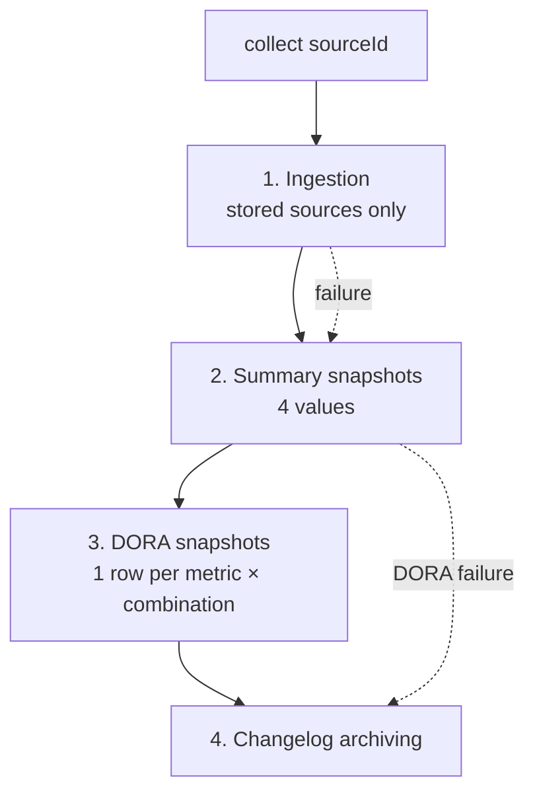
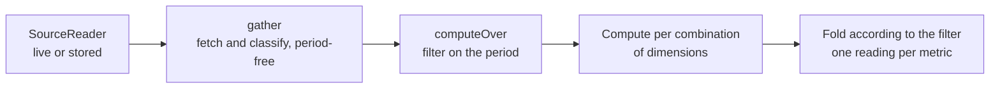

# Collection and DORA metrics

Where the data lives, when it is written, and at what moment a figure is
computed. This document exists because two very different mechanisms sit side by
side and look alike from a distance: **collection**, which writes to the
database at a regular interval, and **reading**, which recomputes almost
everything on every request.

## 1. The principle in one sentence

> **Raw data** is stored. **Metrics** are recomputed on every display. **Metric
> snapshots** serve the charts and nothing else.

Everything else in this document follows from those three lines.

## 2. The two modes of a source

Every source is read through a `SourceReader`, in one of two modes
(`back/src/ingest/reader.factory.ts`):

| Mode | What the reader does | Cost of one display |
|---|---|---|
| `live` | queries the platform (GitHub/GitLab) on every request | API calls every time |
| `stored` | reads what the ingestion filed in the database, **no provider call** | one SQL query |

The mode changes *where* the raw data comes from. It does **not** change the
fact that metrics are recomputed: they are, in both cases.

## 3. Collection — what runs periodically

Two repeatable jobs on the `collection` queue, scheduled by
`collection.scheduler.ts` from the settings:

- **`collect`**, on `collectCron` — the work described below, for each source;
- **`prune`**, on `pruneCron` — the retention sweep (§5).

A third queue, `ingest`, receives the **webhooks**: every delivery is an
`ingest-event` job that updates the store without waiting for the next
collection.

### What `collect(sourceId)` does

In this order (`back/src/collection/collector.service.ts`):



1. **Ingestion** (`sync.syncIfStored`) — for a `stored` source only. It fills
   the store from the platform's listings. It may **skip the listings** when the
   webhooks have demonstrably kept the store current: spending the API budget to
   learn what is already known makes no sense. It hangs off the collection
   rather than off a rhythm of its own — two cadences could only disagree about
   what the numbers describe.

2. **Summary snapshots** — four values with no dimensions: `open_prs`,
   `stale_prs`, `failed_pipelines`, `running_pipelines`.

3. **DORA snapshots** (`dora.snapshot`) — the report is computed, then **one row
   per metric and per combination of dimensions** is written.

4. **Changelog archiving** — the one step whose work cannot be caught up later:
   a deployment whose contents nobody archived before its environment
   disappeared is a changelog no future run will ever produce.

Every step is *best-effort*: a failed ingestion does not stop the snapshot of
what is stored — that is a real reading of a view that has stopped moving, not a
hole in the series.

## 4. Where the data is stored

### Raw ingested data — `stored` sources

| Table | Contents |
|---|---|
| `StoredRepo` | the repositories seen in scope |
| `StoredPullRequest` | pull/merge requests, open and merged alike |
| `StoredPipeline` | pipeline runs |
| `StoredDeployment` | deployments and their environment |

**Metrics are recomputed over these tables** for a `stored` source. A `live`
source has none of them: it calls the platform back.

### Metric snapshots

| Table | Contents |
|---|---|
| `MetricSnapshot` | `metric`, `value`, `dimensions`, `capturedAt` |

One row = **one frozen value, at one instant, for one combination of
dimensions**. It is not recomputable data: it carries the dimensions **as they
were classified at the moment of capture**.

### The rest

`DeploymentChangelog` (contents of archived deployments), `WebhookDelivery`
(delivery traceability), `SyncState` (ingestion cursors).

## 5. The retention sweep

The `prune` job (`back/src/ingest/retention.service.ts`) sweeps, per source,
whatever is older than that source's depth (`historyDays`, falling back to
`doraWindowDays`) extended by `retentionMarginDays`:

- `StoredPipeline`, `StoredDeployment`, `StoredPullRequest` (open ones excepted);
- `WebhookDelivery`, on a retention of the install's own.

**`MetricSnapshot` is never swept.** The metric history accumulates
indefinitely.

## 6. How a metric is computed

Everything starts at `DoraService.build()` (`back/src/dora/dora.service.ts`):



Three things to keep in mind:

**Fetching and computing are two steps.** `gather` fetches and classifies the
events — free of any period — and `computeOver` then applies one with
`within(...)`. Only pull requests and incidents are bounded in the query itself.
That is what makes replaying history cheap: one read serves as many periods as
you like (§9).

**Dimensions are assigned at computation time**, by the environment rules in
force *now* — see `env-rules`. Changing a rule immediately changes every value
on screen.

**Folding produces a median of the whole population**, not an average of medians
(`back/src/dora/aggregate.ts`). A reading that spans several combinations says
so on the detail page.

No metric on screen is ever read back from `MetricSnapshot`.

## 7. Where each figure on screen comes from

| Screen / block | Source | Stored? |
|---|---|---|
| DORA page — the values | recomputed (`/dora`) | no |
| DORA page — the sparklines | `MetricSnapshot` | **yes** |
| Sub-page — the headline value | recomputed (`/dora`) | no |
| Sub-page — the chart | `MetricSnapshot` (`/metrics/series`) | **yes** |
| Sub-page — the event list | recomputed (`/dora/samples`), paginated | no |
| Deployments, Overview, dashboard | recomputed | no |
| Changelogs | `DeploymentChangelog` | **yes** |

## 8. Consequences — the questions this raises

**Why does a value cover 180 days when its chart only shows 5?**
The value is recomputed over the whole ingested depth. The chart can only show
the instants at which a collection **actually wrote** a reading. A five-day-old
install has five days of chart, whatever window is asked for.

**Why does filtering on a dimension shorten the chart?**
A snapshot carries the dimensions it had at capture time. Filtering on
`app=Portal` keeps only the readings written **since that rule existed**.
Renaming a key (`scope` → `Scope`) cuts the series at the same place: the older
points carry the older key, and nothing can reclassify them.

**Why does fixing a computation not fix the history?**
Because the history is not recomputed. Changing the way a metric is measured
immediately changes every value on screen, and leaves the charts exactly as they
were written.

**Why is there no repo filter on the DORA page?**
A snapshot records a metric and its dimensions, **never its repo**. No chart can
therefore be restricted to a repo. The filter was removed so that values and
charts always cover the same scope.

## 9. Replaying history

Past snapshots are recomputed from the raw data by `DoraService.rebuild`. It is
cheap in calls because `gather` (fetch and classify, period-free) is separate
from `computeOver` (compute for one period): replaying ninety days costs **one**
read, not ninety.

1. gather once, reaching a whole window further back than the first day replayed;
2. compute each day over **the sliding window ending that day** — the same one
   the scheduled collection uses, or the replayed points would not mean the same
   thing as the ones around them;
3. **stop at the end of yesterday**: today belongs to the next collection;
4. **replace** the interval in one transaction, sweeping only the DORA metrics —
   the four summary series share this table and are readings of the present,
   which no replay can reconstruct;
5. **write nothing for a day whose window holds no event**: a flat zero would
   read as a measurement, a gap reads as a gap.

### Depth is not the window

Two notions the same number is easily read as. **Depth** is how many days are
rewritten, counted back from yesterday. The **window** is what each of those days
measures, and it stays the `doraWindowDays` setting — replaying does not change
it, and neither does the modal.

With a depth of 90 and a window of 30, on 1 August:

```
Days rewritten:      3 May → 31 July          (90 points)
The 3 May point counts:  3 April → 3 May      (30-day window)
Data read from:      3 April                  (depth + window)
```

To replay on a different window, change the setting first, then replay.

### How to trigger it

| From | What it does | Cost |
|---|---|---|
| **Replay the metric history** (per-source button) | replays alone, depth of your choosing, defaults to the reporting window | no platform listing beyond one read |
| **Re-read the whole history** | re-ingests from the platform, **then** replays over the source's depth | a full re-read, so API budget |

Both exist because they answer two needs. What triggers a replay in practice is
**a classification rule changing** — and that needs no re-read at all: the raw
data is already there, only the reading of it changed.

The replay is attached to a **forced** re-read only. A scheduled run adds a day
to a history the run before it already agreed with, so replaying on every cron
tick would rewrite months of readings every few minutes to land on the same
values.

### What it does not do

The depth stays bounded by what was ingested. Snapshots **older than the replayed
interval are kept**, with the classification they had then, so the two eras sit
on one chart. The job reports how many (`keptBefore`) and both modals say so
before the click.

And the past is re-read through the present classification — usually the point,
but a replayed chart no longer tells you what the install believed at the time.
