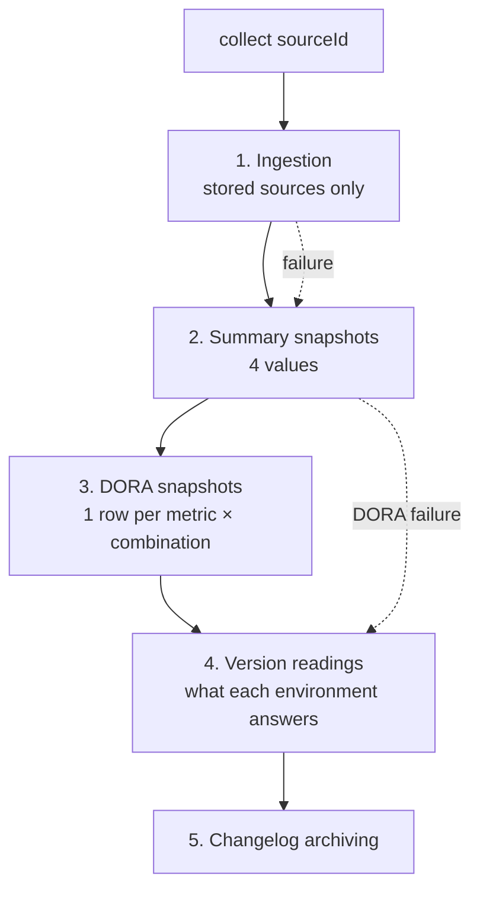
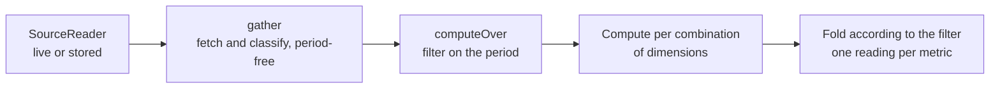

# Collection and DORA metrics

Where the data lives, when it is written, and at what moment a figure is
computed. This document exists because two very different mechanisms sit side by
side and look alike from a distance: **collection**, which writes to the
database at a regular interval, and **reading**, which recomputes almost
everything on every request.

## 1. The principle in one sentence

> **Raw data** is stored. **Metrics** are recomputed on every display. **Metric
> snapshots** serve the charts that are about the history itself, and nothing
> else — a line that illustrates a period is cut from that period, not read
> back from them.

Everything else in this document follows from those three lines.

## 2. The two modes of a source

Every source is read through a `SourceReader`, in one of two modes
(`back/src/ingest/reader.factory.ts`):

| Mode | What the reader does | Cost of one display |
|---|---|---|
| `live` | queries the platform (GitHub/GitLab) on every request | API calls every time |
| `stored` | reads what the ingestion filed in the database, **no provider call** | one SQL query |

The mode changes *where* the raw data comes from. It does **not** change the
fact that metrics are recomputed: they are, in both cases.

## 3. Collection — what runs periodically

Two repeatable jobs on the `collection` queue, scheduled by
`collection.scheduler.ts` from the settings:

- **`collect`**, on `collectCron` — the work described below, for each source;
- **`prune`**, on `pruneCron` — the retention sweep (§5).

A third queue, `ingest`, receives the **webhooks**: every delivery is an
`ingest-event` job that updates the store without waiting for the next
collection.

### What `collect(sourceId)` does

In this order (`back/src/collection/collector.service.ts`):



1. **Ingestion** (`sync.syncIfStored`) — for a `stored` source only. It fills
   the store from the platform's listings. It may **skip the listings** when the
   webhooks have demonstrably kept the store current: spending the API budget to
   learn what is already known makes no sense. It hangs off the collection
   rather than off a rhythm of its own — two cadences could only disagree about
   what the numbers describe.

2. **Summary snapshots** — four values with no dimensions: `open_prs`,
   `stale_prs`, `failed_pipelines`, `running_pipelines`.

3. **DORA snapshots** (`dora.snapshot`) — the report is computed, then **one row
   per metric and per combination of dimensions** is written.

4. **Version readings** (`versions.probeSource`) — each environment with a
   version rule is asked what it is running. Before the archiving rather than
   after it: what a reading confirms is the deployment that just went out, and
   queueing it behind a batch of comparisons would confirm it a good deal later.
   Bounded by an interval and a batch cap — see [Installed
   versions](versions.md) — so an install with no version rule pays one query
   per collection to learn it still has nothing to read.

5. **Changelog archiving** — the one step whose work cannot be caught up later:
   a deployment whose contents nobody archived before its environment
   disappeared is a changelog no future run will ever produce.

Every step is *best-effort*: a failed ingestion does not stop the snapshot of
what is stored — that is a real reading of a view that has stopped moving, not a
hole in the series.

### The second trigger, which is not on this diagram

A version reading is the only work in the install with a **second way in**: a
deployment webhook queues one for the environment it just reached, waits half a
minute for the application to come back, and reads it then. It is on a queue of
its own, deduplicated per environment, and it is described where it belongs —
[Installed versions](versions.md).

The two triggers coexist without arbitration, and deliberately so: the interval
the scheduled probe already respects means it does not re-read what an event
read a minute ago. A source with no webhook behaves exactly as it did before
events existed, which is what makes the event an acceleration rather than a
prerequisite — the same stance the ingestion takes.

## 4. Where the data is stored

### Raw ingested data — `stored` sources

| Table | Contents |
|---|---|
| `StoredRepo` | the repositories seen in scope |
| `StoredPullRequest` | pull/merge requests, open and merged alike |
| `StoredPipeline` | pipeline runs |
| `StoredDeployment` | deployments and their environment |

**Metrics are recomputed over these tables** for a `stored` source. A `live`
source has none of them: it calls the platform back.

### Metric snapshots

| Table | Contents |
|---|---|
| `MetricSnapshot` | `metric`, `value`, `dimensions`, `capturedAt` |

One row = **one frozen value, at one instant, for one combination of
dimensions**. It is not recomputable data: it carries the dimensions **as they
were classified at the moment of capture**.

### What environments answer

| Table | Contents |
|---|---|
| `EnvironmentVersion` | one row per `(source, repo, environment)` — what it runs **now** |
| `VersionChange` | a row each time that version differs from the reading before it |
| `DeploymentVersion` | one row per deployment — what its environment answered **while it was live** |

Three tables and no redundancy between them: they answer three questions that
diverge the moment anything goes wrong. The reasoning is in [Installed
versions](versions.md), and it is worth reading before touching any of them.

### The rest

`DeploymentChangelog` (contents of archived deployments), `WebhookDelivery`
(delivery traceability), `SyncState` (ingestion cursors), `VersionRule` and
`SourceVersionRule` (the rules, and which sources opted into them).

## 5. The retention sweep

The `prune` job (`back/src/ingest/retention.service.ts`) sweeps, per source,
whatever is older than that source's depth (`historyDays`, falling back to
`doraWindowDays`) extended by `retentionMarginDays`:

- `StoredPipeline`, `StoredDeployment`, `StoredPullRequest` (open ones excepted);
- `WebhookDelivery`, on a retention of the install's own.

**`MetricSnapshot` is never swept.** The metric history accumulates
indefinitely.

**Neither are the version tables**, for three different reasons. `EnvironmentVersion`
is bounded by construction — one row per environment, overwritten. `VersionChange`
and `DeploymentVersion` are written on change and per deployment, and neither can
be reconstructed: nobody can go back and ask an environment what it was running
last month. See [Disk and retention](../runbooks/disk-and-retention.md) for the
orders of magnitude.

## 6. How a metric is computed

Everything starts at `DoraService.build()` (`back/src/dora/dora.service.ts`):



Three things to keep in mind:

**Fetching and computing are two steps.** `gather` fetches and classifies the
events — free of any period — and `computeOver` then applies one with
`within(...)`. Only pull requests and incidents are bounded in the query itself.
That is what makes replaying history cheap: one read serves as many periods as
you like (§9).

**Dimensions are assigned at computation time**, by the environment rules in
force *now* — see `env-rules`. Changing a rule immediately changes every value
on screen.

**Folding produces a median of the whole population**, not an average of medians
(`back/src/dora/aggregate.ts`). A reading that spans several combinations says
so on the detail page.

No metric on screen is ever read back from `MetricSnapshot`.

## 7. Where each figure on screen comes from

| Screen / block | Source | Stored? |
|---|---|---|
| DORA page — the values | recomputed (`/dora`) | no |
| DORA page — the sparklines | `MetricSnapshot` (`/metrics/series`) | **yes** |
| Sub-page — the headline value | recomputed (`/dora`) | no |
| Sub-page — the chart | `MetricSnapshot` (`/metrics/series`) | **yes** |
| Sub-page — the event list | recomputed (`/dora/samples`), paginated | no |
| Overview — the values *and* their sparklines | recomputed (`/overview`) | no |
| Deployments, dashboard | recomputed | no |
| Changelogs | `DeploymentChangelog` | **yes** |

## 8. Consequences — the questions this raises

**Why does a value cover 180 days when its chart only shows 5?**
On the pages still drawn from snapshots, the value is recomputed over the whole
ingested depth while the chart can only show the instants at which a collection
**actually wrote** a reading. A five-day-old install has five days of chart,
whatever window is asked for.

The overview no longer works that way, and the reason is worth stating: a
snapshot holds what a metric was worth over the **collection's** configured
window on the day it was taken, so asking for seven days and asking for ninety
were shown the same twelve points. The figures moved with the period and the
lines beside them never did — see [Trends over the period](#10-trends-over-the-period).

**Why does filtering on a dimension shorten the chart?**
A snapshot carries the dimensions it had at capture time. Filtering on
`app=Portal` keeps only the readings written **since that rule existed**.
Renaming a key (`scope` → `Scope`) cuts the series at the same place: the older
points carry the older key, and nothing can reclassify them.

**Why does fixing a computation not fix the history?**
Because the history is not recomputed. Changing the way a metric is measured
immediately changes every value on screen, and leaves the charts exactly as they
were written.

**Why is there no repo filter on the DORA page?**
A snapshot records a metric and its dimensions, **never its repo**. No chart can
therefore be restricted to a repo. The filter was removed so that values and
charts always cover the same scope.

## 9. Replaying history

Past snapshots are recomputed from the raw data by `DoraService.rebuild`. It is
cheap in calls because `gather` (fetch and classify, period-free) is separate
from `computeOver` (compute for one period): replaying ninety days costs **one**
read, not ninety.

1. gather once, reaching a whole window further back than the first day replayed;
2. compute each day over **the sliding window ending that day** — the same one
   the scheduled collection uses, or the replayed points would not mean the same
   thing as the ones around them;
3. **stop at the end of yesterday**: today belongs to the next collection;
4. **replace** the interval in one transaction, sweeping only the DORA metrics —
   the four summary series share this table and are readings of the present,
   which no replay can reconstruct;
5. **write nothing for a day whose window holds no event**: a flat zero would
   read as a measurement, a gap reads as a gap.

### Depth is not the window

Two notions the same number is easily read as. **Depth** is how many days are
rewritten, counted back from yesterday. The **window** is what each of those days
measures, and it stays the `doraWindowDays` setting — replaying does not change
it, and neither does the modal.

With a depth of 90 and a window of 30, on 1 August:

```
Days rewritten:      3 May → 31 July          (90 points)
The 3 May point counts:  3 April → 3 May      (30-day window)
Data read from:      3 April                  (depth + window)
```

To replay on a different window, change the setting first, then replay.

### How to trigger it

| From | What it does | Cost |
|---|---|---|
| **Replay the metric history** (per-source button) | replays alone, depth of your choosing, defaults to the reporting window | no platform listing beyond one read |
| **Re-read the whole history** | re-ingests from the platform, **then** replays over the source's depth | a full re-read, so API budget |

Both exist because they answer two needs. What triggers a replay in practice is
**a classification rule changing** — and that needs no re-read at all: the raw
data is already there, only the reading of it changed.

The replay is attached to a **forced** re-read only. A scheduled run adds a day
to a history the run before it already agreed with, so replaying on every cron
tick would rewrite months of readings every few minutes to land on the same
values.

### What it does not do

The depth stays bounded by what was ingested. Snapshots **older than the replayed
interval are kept**, with the classification they had then, so the two eras sit
on one chart. The job reports how many (`keptBefore`) and both modals say so
before the click.

And the past is re-read through the present classification — usually the point,
but a replayed chart no longer tells you what the install believed at the time.

## 10. Trends over the period

The overview draws its sparklines from the period being reported on, not from
the snapshot table. `DoraService.reportOverTime` cuts the resolved period into
consecutive slices (`back/src/dora/series.ts`) and computes each one from **the
same gathering** — the trick `rebuild` uses, and the reason a line costs no
extra read.

Three rules decide what a point is:

- **At most twelve slices, never finer than a day.** A sparkline is a word
  wide, and slicing a two-day period into twelve produces eleven empty
  readings and one spike. A week draws seven points, a quarter twelve.
- **Slices are disjoint and cover the whole period.** Each starts a millisecond
  after the last ends — a period includes both its bounds, so an event landing
  on a seam would otherwise be counted twice. Summing the points therefore gives
  the figure beside them, for a count.
- **An empty slice is a zero for a count and a gap for anything else.** Nothing
  deployed is genuinely zero deployments; nothing merged is not a lead time of
  zero, it is the absence of one. The line steps over it rather than dropping
  to the floor.

Two consequences follow, and both are deliberate. The last point is the last
*slice*, not the value beside it: the figure covers the whole period and the
point covers a twelfth of it. And the delta arrow now compares the first slice
with the last — how the period went — where it used to compare two overlapping
rolling windows that shared eleven twelfths of their data, which is why it
barely ever moved.

> The DORA page's own block sparklines still come from `MetricSnapshot`, and
> still answer over the collection's window rather than the selected period.
> They are the one place left where a line and the figure above it are read two
> different ways.

## 11. What the overview's period governs

The filter bar sits at the top of the page, so it looks like it governs the
whole of it. It does not, and the split is deliberate — each block answers a
different tense, and the page now says which:

| Block | Window | Why |
|---|---|---|
| **État** — the environment table | the period | A row is a report: its deployment count and its heartbeat describe the window, and an environment nothing reached inside it is not a row. Its head states the window beside the count. |
| **Ce qui tourne** — the instrument matrix, and the journal's side rail | none | Which version is live for which client. A version that has *not* moved is the one thing a matrix of live versions is looked at for, so no period narrows it. |
| **Flux** — the metrics | the period | Values and sparklines alike, both cut from it — see [Trends over the period](#10-trends-over-the-period). |
| **Friction** | the present | Open pull requests, running pipelines, last collection. An open pull request is not "open during July": period-scoping these would change the question rather than narrow it. |
| **Journal / frieze** — recent activity | fixed, 48 h (24 h for the frieze's axis) | Read after an alert, not to report a quarter. It says so in its head and in its empty state. |

Two consequences of the **État** table following the period:

- **An environment deployed before the period disappears from it.** On seven
  days, a stable production is not listed — the table answers "what moved, and
  how did it go", and the empty state names the period as a possible cause. The
  matrix is unaffected: the report carries two lists, `environments` for the
  period and `running` for the present, and the collection reads both in one
  round (`CollectedSource.latest`). On a live source the second listing is the
  most recent page per repo, beside a bounded read that already pages twenty
  deep — a twentieth more, for a question the period cannot answer.
- **`ref` is the last deployment of the period, not of all time.** Over a
  window ending now the two are the same sentence; over one that ended last
  month it is "what was running at the end of it", which is the honest reading
  there.

The dimension vocabulary is built over **both** lists: a value only an
out-of-period environment carries is still a value the filter has to offer, or
narrowing the period would quietly remove the dimension you would widen back on.

The collection reads back to whichever of the two windows reaches furthest
(`readFrom`, `back/src/overview/overview.service.ts`): a one-day period must
not cost the journal its second day.
