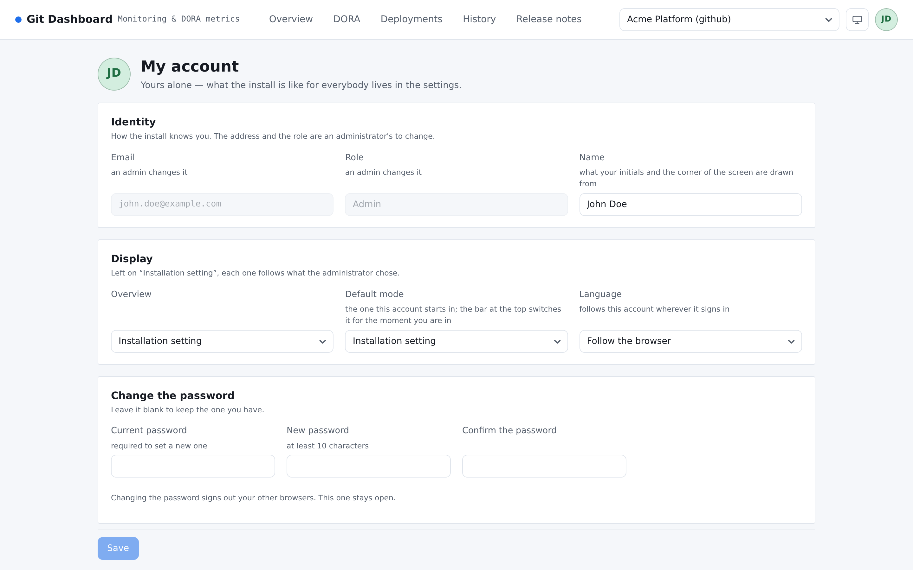

==========
My account
==========

Yours alone. What the install is like for everybody else lives in
:doc:`settings`, and needs an admin.

         this account.

   Three blocks, all of them about you.

Identity
========

How the install knows you.

.. list-table::
   :header-rows: 1
   :widths: 25 75

   * - Field
     -
   * - **Name**
     - Yours to change. What your initials and the corner of the screen are
       drawn from
   * - **Email**
     - An admin's to change — it is how you sign in
   * - **Role**
     - An admin's to change. *Admin* configures the install, *User* reads it

Password
========

Setting a new one requires the current one, and **signs out your other
browsers**. The one you are using stays open.

Leave the field blank to keep the password you have.

If you cannot sign in at all, this page is out of reach: an admin issues a
reset link from :ref:`settings-accounts`. That link works once, and using it
signs the account out everywhere.

Display
=======

Preferences that follow **this account**, wherever it signs in — not this
browser.

.. list-table::
   :header-rows: 1
   :widths: 25 75

   * - Setting
     - What it does
   * - **Overview**
     - Which of the three readings :doc:`overview` opens on
   * - **Default mode**
     - Light, dark, or the machine's own setting. The bar at the top switches
       it for the moment you are in; this is the one the account *starts* in
   * - **Language**
     - The language of the interface

Left on **Installation setting**, each one follows what the administrator
chose. Language additionally offers **Follow the browser**, which is what an
account that has never stated one does.

.. note::

   The interface is translated; this guide is not. Every label quoted in these
   pages is the English one, so an account reading in another language will not
   find them on screen word for word. Switching this setting to English is the
   quickest way to follow along.
