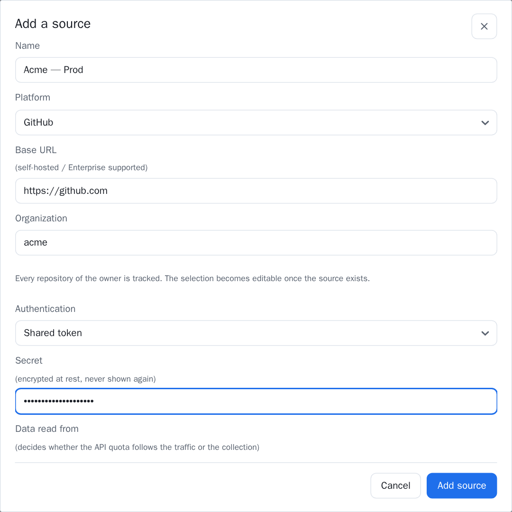

====================
Platform credentials
====================

What to create on GitHub or GitLab, what to grant it, and why each grant is
asked for. Everything on this page is **read-only**: no call any connector makes
writes anything to your platform.

         kind, and the secret field the credential is pasted into.

   Whatever you create below ends up in one field of this form — **Settings ›
   Sources**. It is encrypted the moment it is saved and never shown again.

.. important::

   A missing permission does not fail loudly. The services degrade rather than
   lose the whole view, so the symptom is a **panel that stays empty** — not an
   error. **Test connection** only exercises the repository listing, so it
   passes on a credential that will still come up short on, say, deployments.

   If a page is empty and the source tested green, read
   :ref:`credentials-symptoms` at the foot of this page.

GitHub: an App or a token
=========================

Both work. They differ in what they cost to keep alive:

.. list-table::
   :header-rows: 1
   :widths: 25 75

   * -
     - Worth knowing
   * - **GitHub App**
     - Permissions are per resource, so nothing wider than the calls is
       granted. It belongs to the organization rather than to a person, and it
       does not leave when they do. Its token is minted per call and expires by
       itself
   * - **Personal access token**
     - Faster to create, and tied to the person who created it: their leaving,
       or losing an access, takes the dashboard with them. A classic token is
       also far wider than what is needed

For anything beyond a trial, prefer the App.

.. _credentials-github-app:

Creating the GitHub App
=======================

**Settings › Developer settings › GitHub Apps › New GitHub App**, on the
organization.

Grant these six repository permissions, all at **Read-only**:

.. list-table::
   :header-rows: 1
   :widths: 20 45 35

   * - Permission
     - What reads through it
     - Missing it costs you
   * - **Metadata**
     - Listing the organization's repositories, and reading each one's default
       branch. Mandatory on every GitHub App anyway
     - Everything. No repository is found at all
   * - **Contents**
     - Tags, branches, commits, and the comparison between two refs
     - :doc:`release-notes`, the contents of a deployment, and the whole of
       :doc:`history`
   * - **Pull requests**
     - Open and merged pull requests, plus their commits and their reviews
     - Lead time and its four segments, and the open pull requests panel on
       :doc:`overview`
   * - **Actions**
     - Workflow runs
     - The pipeline counts under *Friction*, and the pipelines panel
   * - **Deployments**
     - Deployments and their statuses
     - :doc:`deployments`, deployment frequency, change failure rate and MTTR —
       the four of them at once
   * - **Issues**
     - Issues carrying one of your incident labels
     - Incidents only. Skip it unless *Failure source*
       (:ref:`settings-general`) counts incidents **and** they live on GitHub

Then **install it on the organization** and grant it the repositories the
source's scope covers. An installation only ever sees what it was given, so a
repository missing here is a repository missing from every metric — and nothing
says so.

What to paste into the form
---------------------------

Creating the App leaves you with three values, which is what *GitHub App*
authentication asks for:

.. list-table::
   :header-rows: 1
   :widths: 30 70

   * - Field
     - Where it comes from
   * - **App ID**
     - The App's own settings page
   * - **Installation ID**
     - The URL of the installation, once it is installed on the organization —
       the number at the end of ``…/installations/<id>``
   * - **Private key (PEM)**
     - *Generate a private key* on the App page downloads a ``.pem``. Paste its
       contents, whole

The private key is encrypted the moment it is saved and never shown again.

GitHub tokens
=============

**Fine-grained** — the same six repository permissions as
:ref:`the App <credentials-github-app>`, at Read-only, scoped to the
repositories you want read. The table above applies unchanged.

**Classic** — two scopes:

.. list-table::
   :header-rows: 1
   :widths: 20 80

   * - Scope
     - Why
   * - ``repo``
     - The only scope that opens private repositories, and it covers contents,
       pull requests, Actions, deployments and issues in one
   * - ``read:org``
     - Listing the organization's repositories rather than the user's

.. warning::

   ``repo`` also grants **write**. GitHub has no read-only variant of it, so a
   classic token is necessarily broader than what the dashboard does with it.
   That is a reason to prefer a fine-grained token or an App wherever you can,
   and a reason not to leave a classic one in place after a trial.

   On a public-only organization, ``public_repo`` instead of ``repo`` is
   narrower and enough.

GitLab
======

A **group access token** — or a personal one, with the same caveat about
belonging to a person — with a single scope:

.. list-table::
   :header-rows: 1
   :widths: 20 80

   * - Scope
     - Why
   * - ``read_api``
     - Everything is read through the API: the group's projects, merge requests
       and their commits, pipelines, deployments, tags, branches, comparisons,
       and issues. GitLab has no per-resource split to make here, so this one
       scope is the whole grant

``read_repository`` is **not** a substitute: it grants Git-level access to the
code, which is not where any of these figures come from.

The token also carries a **role**, and it is the part most often set too low.
*Reporter* is the lowest that can read merge requests, pipelines and
deployments; *Guest* cannot, and a Guest token tests green while every page
stays empty.

Webhooks
========

Optional, and only on a **stored** source. They shorten the delay between
something happening and the dashboard saying so; the scheduled synchronisation
stays the safety net rather than being replaced.

Turning **Accept events (webhooks)** on gives you a delivery URL and a secret —
**shown once**. Copy it then: closing the window makes it unreadable for good,
and issuing a new one invalidates the old immediately.

On the platform side:

.. list-table::
   :header-rows: 1
   :widths: 20 80

   * - Platform
     - What to declare
   * - **GitHub**
     - The delivery URL, the secret, content type **application/json**, and
       three events: ``pull_request``, ``workflow_run``, ``deployment_status``
   * - **GitLab**
     - The delivery URL, the secret, and three triggers: *Merge request
       events*, *Pipeline events*, *Deployment events*

.. note::

   On GitHub the default content type is ``form-urlencoded``. It is accepted and
   then **nothing is ingested from it** — a webhook that reports success while
   changing nothing. Pick ``application/json``.

   Any other event is accepted and ignored, so subscribing to more costs
   traffic and nothing else. Each of the three reads through a permission the
   App already has: pull requests, Actions, deployments.

.. _credentials-symptoms:

Reading an empty page as a missing grant
========================================

.. list-table::
   :header-rows: 1
   :widths: 45 55

   * - What stays empty
     - The grant to look at
   * - No repository at all, or *Test connection* fails
     - Metadata, ``read:org``, or the owner is wrong
   * - :doc:`deployments`, and every deployment metric
     - Deployments
   * - Lead time and its segments, open pull requests
     - Pull requests
   * - Pipeline counts under *Friction*
     - Actions
   * - :doc:`release-notes`, deployment contents, :doc:`history`
     - Contents
   * - Change failure rate and MTTR, while deployments are listed
     - Issues, or *Failure source* is set to pipelines
   * - One repository missing while the others are fine
     - The App installation was not granted that repository

An admin can also read the collection's own account of it: the warnings banner
on :doc:`overview` names the collection that failed, and
:ref:`settings-jobs` says whether one ran at all.
