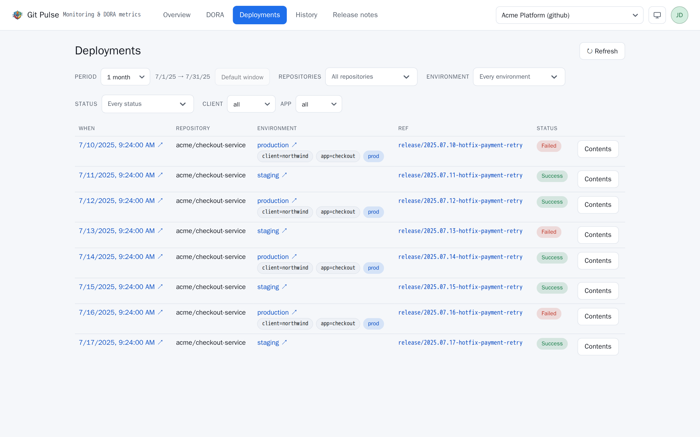

===========
Deployments
===========

What went where, when, and whether it worked — then, for any one of them, the
commits it carried.

         repository, environment, ref and status.

   One row per deployment, newest first.

The list
========

Filtered by period, repository, environment, status and dimensions. Every
filter is in the URL, so a filtered list is a link somebody else can open.

.. list-table::
   :header-rows: 1
   :widths: 22 78

   * - Column
     - What it holds
   * - **When**
     - When the platform recorded the deployment, not when the pipeline started
   * - **Repository**
     - Where the deployed code lives
   * - **Environment**
     - The environment as the platform names it. The dimensions your rules
       extract from that name are what the filters offer
   * - **Ref**
     - What was deployed: a tag, a branch or a commit
   * - **Status**
     - Success, Failed, Running, Pending, Canceled, Skipped, or Unknown
   * - **Live version**
     - What the environment answered while this deployment was the live one —
       empty unless a version rule reads it. :doc:`versions` explains the
       column, and why *current state* and *not read* are not the same thing

*Unknown* is its own status and not a failure. It is what the platform
returned; :doc:`change failure rate <dora>` excludes it rather than counting it
as either outcome.

And *Success* is a statement about the pipeline, not about the environment.
Whether the thing actually came up on the new version is a different question —
:doc:`versions` is where it is answered.

What a deployment carried
=========================

**Contents** on any row opens the commits between that deployment and a base —
because "what shipped" is a question about a *difference*, and the difference
depends on what you compare against.

.. list-table::
   :header-rows: 1
   :widths: 30 70

   * - Base
     - Answers
   * - **The previous deployment here**
     - *What is new on this environment since last time?* The default, and the
       one to use for a release note
   * - **The default branch**
     - *How far behind is this environment?* What is on ``main`` and not here
   * - **Any ref you name**
     - A tag, a branch, or a commit sha — anything the platform resolves.
       Picked from a list or typed

The header states which base is in effect, so a diff is never read against the
wrong thing, and the summary counts what it found: *N commits · M authors*.

Two answers that look like errors and are not:

*No earlier successful deployment to this environment over this period*
   Nothing to compare against — this is the first one the period holds. The
   default branch is the other base on offer.

*Nothing between the two refs*
   The two refs are the same tree. Deploying the branch you are comparing
   against is the usual reason.

.. note::

   The comparison is resolved by the **platform**, live, at the moment you open
   it. It is exact — no correlation, no guessing — and it is also the reason
   this stops working once a branch is deleted or a tag moved. What survives
   that is :doc:`history`, which writes the answer down while the platform can
   still give it.

Live or stored, and what changes
================================

On a **live** source the list is fetched from the platform on every view: it is
of the moment, and it spends API budget in proportion to how often somebody
looks at it.

On a **stored** source it is served from the store, dated by the last
collection, and reading it costs nothing. See :doc:`getting-started` for which
one to choose.

When the list is empty
======================

*No deployment matches these filters over this period* is a filter answer, not
an error. In order of likelihood:

#. The period is narrower than your release cadence.
#. A dimension filter is set from another page — they travel in the URL.
#. The credential is missing the deployments permission. It fails quietly: a
   source that passed **Test connection** can still come up short here, because
   *Test* only exercises the repository listing.
#. On a stored source, no collection has run yet.
