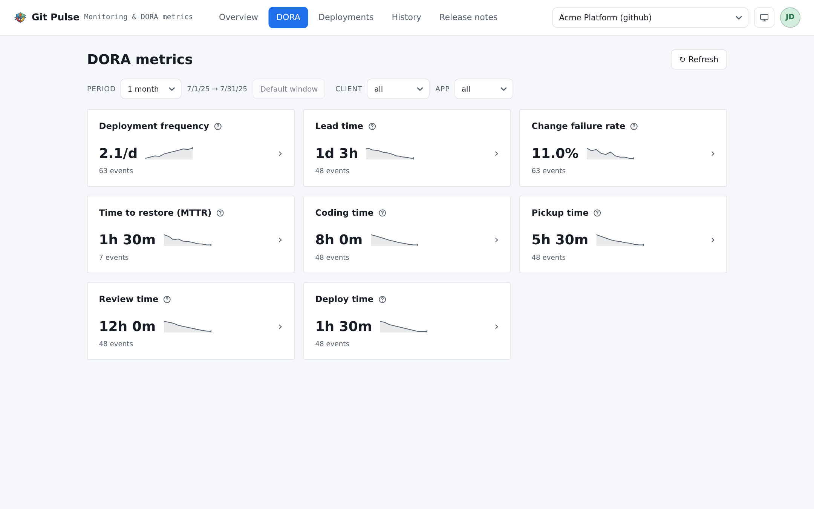
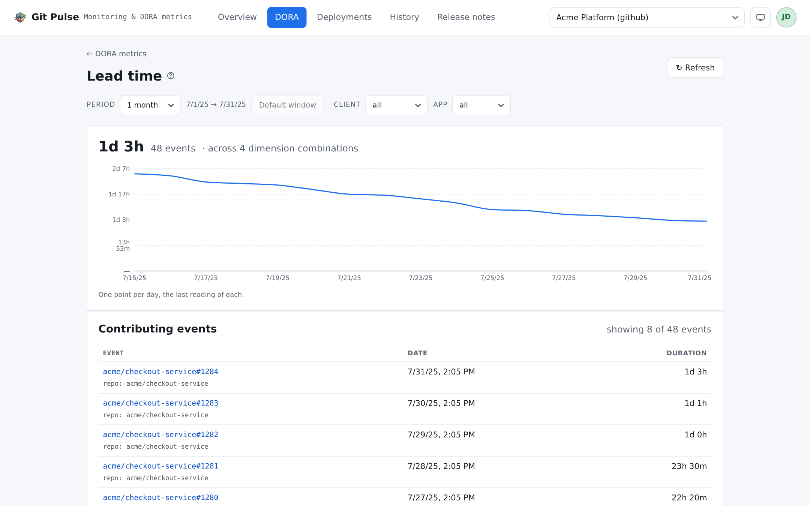

============
DORA metrics
============

The four metrics of the DORA report, plus the four segments lead time breaks
into, over whatever period and slice the filter bar asks for.

         sparkline and the number of events behind it.

   One card per metric. The caret opens what the figure is made of.

What each metric is
===================

Every card carries a **?** that says this on the page itself. Repeated here
because the definitions are what make two installs comparable — or not.

.. list-table::
   :header-rows: 1
   :widths: 30 70

   * - Metric
     - Measured as
   * - **Deployment frequency**
     - Successful deployments **per day**. Shown as a cadence — ``4.2/d``,
       ``1.4/w``, ``0.9/mo`` — so two windows of different lengths can be
       compared, and so the figure sits on the published scale as it is. A high
       frequency means smaller, less risky batches
   * - **Lead time**
     - Median time from a pull request's first commit to its merge — how long
       a change takes to be ready to ship
   * - **Change failure rate**
     - Share of failed deployments among those **with a known status**.
       Undetermined ones are excluded rather than counted as successes
   * - **Time to restore (MTTR)**
     - Median time between a failed deployment and the next successful one of
       the **same repository** on the same environment

And the four segments lead time splits into:

.. list-table::
   :header-rows: 1
   :widths: 30 70

   * - Segment
     - Measured as
   * - **Coding time**
     - First commit → the pull request being opened
   * - **Pickup time**
     - Opened → first review
   * - **Review time**
     - First review → merge
   * - **Deploy time**
     - Merge → the deployment that carried it

.. warning::

   Two of these are approximations, and the page says so rather than hiding it.

   **Pickup and review time** need a review. Where the platform exposes none,
   the first comment by somebody else stands in for it — an approximation, not
   an equivalence.

   **Deploy time** is correlated by repository and date, because no connector
   exposes which commits a deployment contains. Read it as an **upper bound**.
   It is also grouped by where the change landed: filter on ``type=Prod`` to
   get the delay to production rather than to the first environment reached.

The figure and the history are two different things
===================================================

Each card carries both — a value, and a line under it — and they answer two
different questions. Reading one for the other is the misinterpretation this
page can produce, so it is worth thirty seconds.

.. list-table::
   :header-rows: 1
   :widths: 30 70

   * - On a card
     - What it is
   * - **The value**
     - The metric itself, recomputed from the events at every read, over
       exactly the period and the slice the filter bar asks for. Nothing is
       read back from storage: a classification rule corrected a minute ago is
       already in it. It reaches as far back as what was collected.
   * - **The line under it**
     - The **history**: the readings the scheduled collection stored as it
       took them, one point per day. Each point measures the collection's own
       window on the day it was taken — not the period you picked — and no
       later correction rewrites it. It starts the day this install began
       collecting.

So the value tells you *where you stand*, and the line *which way it is going*.
A fresh install shows a correct figure over ninety days beside five days of
curve, and neither of the two is wrong.

.. note::

   Widening the period is therefore only half of what it takes to see a long
   evolution: the curve also needs readings to have been taken over that span.
   **Replay the metric history** in :ref:`settings-sources` rewrites them from
   the raw data already stored, over a depth you choose and without re-reading
   the platform. It is also the only way to push a corrected rule into the
   past — the figures follow a rule change immediately, the history never does.

The overview page works the other way round: its sparklines are cut from the
period being reported on rather than from the stored readings, because there
the subject is the period. See :doc:`overview`.

The period
==========

The window is picked from 7, 15, 30, 60 and 90 days, 6 months and 1 year, or
set to explicit bounds with *Custom…*.

- **A bound left empty stays open.** With no end date the period runs up to
  now.
- The bounds are applied in one press, not as you type: each recomputation is a
  full round of calls to the platform.
- Untouched, the dropdown shows the window resolved by the server — the one
  configured in :ref:`settings-general` — so what you read is what you filtered
  on.
- A window stored before the presets changed stays selectable instead of being
  silently rewritten by the first save. That is why an install can show *2
  years* where the list stops at one.

Slicing
=======

The dimension filter narrows the scope, and the cards answer about the narrowed
scope. A metric nothing was computed for has **no card at all** — the filters
narrow what is visible as well as what each card says.

There is deliberately no breakdown table. Cards used to be one row per
dimension combination, which turned the page into a cross product nobody read
past the first screen.

Under each value, *N events* is the population the figure rests on. A median
over four events and one over four hundred are both medians; only one of them
is worth acting on.

How a filtered figure is put together
-------------------------------------

A metric is computed per dimension **combination** — one value for
``{type: Prod, client: acme}``, another for ``{type: Prod, client: globex}`` —
and a filter usually leaves several standing. Recomposing them into the single
figure on the card follows the metric, not a single rule:

- **Deployment frequency adds up.** Two a day on one combination and three a
  day on another is five a day: they cover the same period, so averaging would
  answer a question nobody asked.
- **Lead time, MTTR and the four segments are a median over every event
  retained**, all combinations pooled — not an average of their medians, which
  would be neither.
- **Change failure rate is weighted by volume**, which amounts to *total
  failures ÷ total deployments*. A combination measured on three deployments
  never weighs as much as one measured on three hundred.

A combination that does not carry the filtered key at all is left out rather
than kept: filter on ``client=acme`` and a pull request nothing could classify
by client leaves the figure.

Nothing is read back from storage here. Every change of period or of slice
recomputes the metrics from the events themselves, which is also why the bounds
are applied in one press.

One metric in detail
====================

The caret opens the metric under **the filters the card was showing** — they
travel in the URL. A value computed over another period or another slice is a
different number, and a detail page that disagreed with the card it was opened
from would be worse than no detail page.

The same filter bar sits on the detail page, so a scope can be narrowed without
walking back to the list: the reading, its chart and its events all follow, and
the figure is recomposed exactly as the card's was. What is picked here is what
the breadcrumb returns to.

When the filter still leaves several combinations, the page says so under the
value — *across N dimension combinations* — so a figure is never read as being
about one slice while the events below it come from across the lot.

When the filter leaves **nothing** standing, the page says which of the two
reasons applies. A combination that was simply never deployed nor merged over
the period is one thing; a key — or a value — that no event behind this metric
ever carried is another, and the filter bar cannot tell them apart on its own:
it offers every key, and every value, seen anywhere on the report.

A dimension is an attribute of the **events a metric is measured on**, and the
two families are classified by different rules: deployments by the environment
rules of :ref:`settings-environments`, merged pull requests by the PR labels and
PR titles tabs beside them. So filtering on a key only the environments carry —
``type``, typically — leaves the lead time and its three segments with nothing
at all, whatever the period. The page names the key rather than blaming the
period, and the fix is a rule giving pull requests the same attribute, by label,
by title or by repository name: see :ref:`monorepo-dimensions`.

         the events contributing to the value.

   How it moved, then what it is made of.

**The trend** comes from the historised readings, not from a recomputation:
each point is a reading taken at the time, over the window configured then. One
point per day, the last reading of that day — the page names it under the
chart, so a flat line is never mistaken for missing history.

Which is why the last point and the figure above it need not be the same
number, and neither is wrong. The figure is recomputed now and weighted by the
events behind each combination; a stored reading records a value and not how
many events it rested on, so the line can only weigh its combinations evenly.
Read the chart for the movement and the figure for the value.

Filtering narrows the chart too, to the stored combinations the filter selects.
Two messages are then not failures:

- *No history yet* — nothing has been historised for this metric under this
  slice: either the scheduled collection has not run at all, or it never ran
  while that slice existed. Readings are historised as they are taken and
  nothing back-fills them, so the figure above stays perfectly computable
  meanwhile — the events are still there, the past readings are not.
- *Only one reading* — a trend needs two.

**Contributing events** is the population itself — the one the figure was
computed on, under the same period and the same slice — paged by the server and
newest first: the pull requests behind a lead time, the deployments behind a
failure rate, the failure and the recovery behind an MTTR. Each row carries its
date, its duration and its repository, and links back to the platform. Changing
a filter returns to the first page: an offset into another population points at
nothing.

.. note::

   *This metric no longer exists for that combination over the requested
   period* means the link outlived the data it pointed at — a rule was changed,
   or the period was moved. The figure is not wrong; the combination has
   stopped existing.

When the page is empty
======================

*No data yet — configure environment rules and run a collection.* In that
order, and it is almost always the first half:

#. **No collection has run.** On a stored source, *Collect now* in
   :ref:`settings-sources`.
#. **No rule matches.** Lead time and its segments need repository rules;
   without them a pull request has no environment and falls into one global
   bucket. Change failure rate needs incident rules, or it finds no deployment
   to divide by. :ref:`settings-environments`.
#. **The window is shorter than your cadence.** Four deployments a month over a
   seven-day window is a page of empty cards and a correct one.

.. tip::

   Metrics are recomputed from what is stored, on every read. Correcting a rule
   fixes the figures immediately, with nothing to re-run — **except** the
   historised readings behind the trends, which were computed at the time.
   Those are replayed explicitly, from :ref:`settings-sources`.
