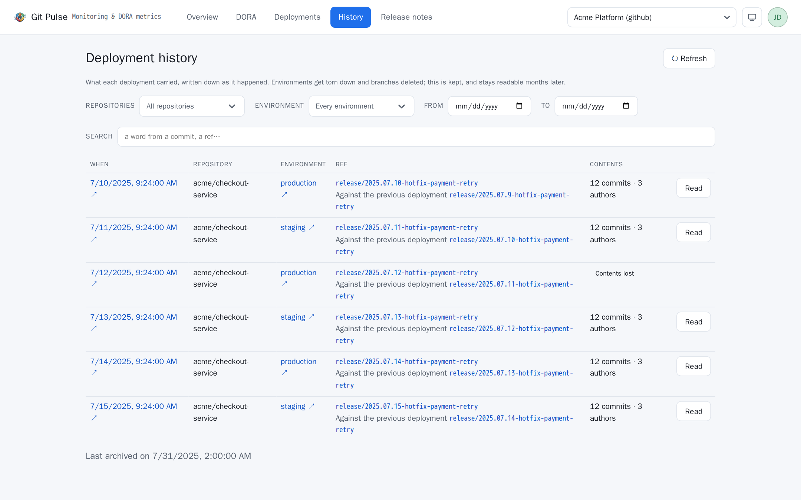

=======
History
=======

The same question as :doc:`deployments` — *what did this deployment carry?* —
asked months later, after the platform has stopped being able to answer.

         ref, and the commits each one carried.

   What each deployment carried, filed while it could still be established.

Why this page exists
====================

The commits behind a deployment are not stored by the platform as a fact. They
are *computed* on demand, by comparing two refs — and refs do not last.
Branches get deleted, tags get moved, environments get torn down, repositories
get archived. Ask in March and you get an answer; ask in September about March
and you get an error.

So the collection asks the question **while the platform can still answer**,
and writes the answer down. This page reads what was written.

That has a consequence worth stating plainly: **an entry appears here only if a
collection ran while the deployment was still resolvable.** Nothing back-fills
history. A source connected today has no archive of last year, and never will.

Reading it
==========

.. list-table::
   :header-rows: 1
   :widths: 25 75

   * - Control
     - What it does
   * - **Search**
     - A word from a commit message, or a ref
   * - **From** / **To**
     - Bounds on when the deployment happened
   * - Repository, environment, dimensions
     - The same scope filters as everywhere else
   * - **Read** / **Hide**
     - Unfolds the archived contents in place

Each entry carries *Archived on …*: when the collection filed it, which is not
when the deployment happened. The gap between the two is how long the platform
was still able to answer.

Two notes you will meet
=======================

*First deployment to this environment*
   It carried everything, and there was nothing before it to compare against.
   Not a gap in the archive — the archive is complete and the answer is
   *everything*.

*Contents lost*
   The deployment was filed, but without its commits: by the time the archiver
   reached it, the platform no longer resolved the refs. **That it went out, on
   this ref, at this time, is what remains of it** — and that is deliberately
   kept rather than dropped, because a deployment nobody can list the contents
   of is still a deployment that happened.

   Seeing many of these means the collection is running too far behind the
   deletions. Collect more often, or keep branches a little longer.

When it is empty
================

*Nothing archived yet.* Deployments are filed by the collection, so the first
entries appear after its next run. On a **live** source nothing is ever filed —
archiving is something the collection does, and a live source has no
collection.

.. note::

   This archive is also what the retention sweep prunes, on the schedule an
   admin sets. What it deletes and how to tell it ran are in the
   :repo:`disk and retention runbook <docs/runbooks/disk-and-retention.md>`.
