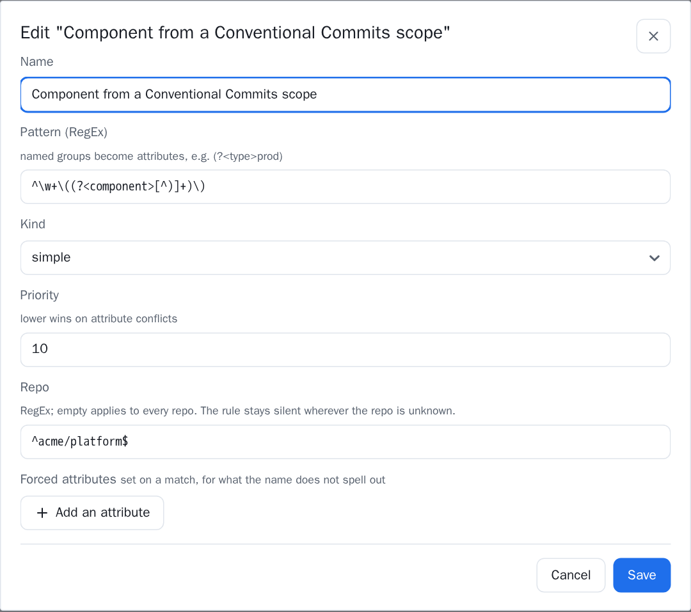

========================
Monorepo, or one per app
========================

Git Pulse reads both, and needs telling nothing to read the ordinary case. What
follows is for the other one: a repository holding several things that ship on
their own.

Everything on this page is inert until you configure it. An install that never
opens it behaves exactly as it did.

Why a monorepo is different
===========================

Almost every figure in the application is sliced by **dimensions** — ``app``,
``type``, ``client`` — extracted from your naming conventions by the rules in
:ref:`settings-environments`. Deployments get theirs from environment names.
Pull requests, having no environment, got theirs from the **repository name**.

That last one is the whole difficulty. In a monorepo the repository name is a
constant, so it classifies every merged request identically: lead time,
coding time, pickup time and review time collapse into a single global figure
that no filter can break down.

The deployment side is unaffected — environments are still named per component,
so the rules still tell ``front-prod`` from ``api-prod``. The imbalance between
the two sides is where the three points of attention below come from.

Two shapes, and only one of them needs the work
-----------------------------------------------

.. list-table::
   :header-rows: 1
   :widths: 30 70

   * - Your monorepo
     - What to do
   * - **Ships as one unit** — one pipeline, everything goes out together
     - Nothing on this page except :ref:`monorepo-collection`. One repository
       *is* one deployable, which is the assumption the application already
       makes. Deploy time is if anything more accurate than on split repos
   * - **Ships per component** — ``front``, ``api`` and ``worker`` released
       separately
     - All of it. The three points below are, in order, a missing breakdown, a
       wrong figure, and a wrong range

.. _monorepo-dimensions:

1. Giving a request something to be classified by
=================================================

Two tabs in :ref:`settings-environments` match against what a request carries
of its own rather than against what holds it. Neither costs an API call —
labels and titles arrive in the listing the collection already reads.

**PR titles**, if your teams write Conventional Commits. Nothing to apply, no
bot to install, and it works on history already merged:

.. code-block:: text

   Pattern   ^\w+\((?<component>[^)]+)\)
   Kind      simple
   Repo      ^acme/platform$

``feat(front): add the picker`` then classifies as ``component=front``.

         priority, and the Repo field confining it to one repository.

   The same rule in the form. **Repo** is what keeps it inside the monorepo.

**PR labels**, for everyone else, or where the titles are not trusted:

.. code-block:: text

   Pattern   ^area/(?<component>.+)$
   Kind      simple
   Repo      ^acme/platform$

.. tip::

   **Fill in the Repo field.** A rule confined to ``^acme/platform$``
   contributes to that repository and stays silent everywhere else, which is
   what lets one install hold a monorepo and a dozen ordinary repositories with
   nothing to declare about either. There is no "this repository is a monorepo"
   switch, and there is deliberately none: the granularity would be wrong the
   moment a source holds both.

Where several rules answer, the merge order is **label, then title, then
repository name** — what the request says of itself beats what merely holds it.
A request carrying two labels that disagree settles on the alphabetically first
one, so the outcome never depends on the order the platform happened to list
them in.

.. _monorepo-deployable:

2. Telling the right release from the one that went out first
=============================================================

Merge → deployment is correlated by repository and time, because no platform
says which commits a deployment contains. In a monorepo every component shares
that repository, so a front-end change is paired with whichever component
deployed first after the merge. **Deploy time then measures somebody else's
release** — not a loose upper bound, a different thing entirely.

The fix is one field in :ref:`settings-general` → **Deployable attribute**: the
name of the dimension that designates something deployable. Write ``component``
there and the correlation only pairs a request with deployments carrying the
same ``component``.

For it to work, both sides have to produce that attribute:

.. list-table::
   :header-rows: 1
   :widths: 30 70

   * - Side
     - Rule
   * - Deployments
     - An **Environments** rule extracting it from the environment name —
       ``^(?<component>front|api|worker)-(?<type>prod|staging)$``
   * - Pull requests
     - A **PR labels** or **PR titles** rule, as above

.. important::

   **Both sides must spell the value identically.** ``component=api`` from the
   environment names and ``component=backend`` from the labels are two
   different components as far as the correlation is concerned, and deploy time
   goes empty for that repository. The backend logs a warning naming the
   repository and the value when this happens — it is the one way this setting
   can make a metric disappear.

   Where either side says *nothing*, the correlation quietly falls back to
   repository and time, exactly as before. So a half-written rule set degrades
   to the old behaviour rather than to an empty page, and improves as the
   missing rule arrives.

3. Release notes over the right range
=====================================

A monorepo tags per component, so its tags interleave: ``front@1.2.0``,
``api@3.0.1``, ``front@1.3.0``. Every default on :doc:`release-notes` reads
*the most recent tag* and *the tag below it*, which on such a list means
whichever component released last — a range starting at another component's
release, and a note listing commits nobody asked about.

The :ref:`Component field <release-notes-component>` on that page takes a RegEx
— ``^front@`` — applied before those defaults. The bound pickers then offer that
component's releases and nothing else, so what you pick and what the defaults
would have picked agree. It travels in the URL like the rest of the range.

A pattern matching nothing yields no tag at all, hence the whole history up to
the default branch: what a first release of a new component actually is.

.. _monorepo-collection:

Optimising the collection
=========================

This section applies to **both** monorepo shapes, and it is the one thing worth
reading even if you never configure a dimension.

Every deep listing is bounded by a **date**, and what stops it is a **page
count** — :ref:`settings-general` → **API page cap**, twenty by default. That
budget is per repository and per listing. Ten repositories are ten budgets; the
same traffic inside one monorepo is one.

So a ninety-day window that read comfortably across ten repositories can run
out of pages inside a single one. The metrics are then computed over whatever
those pages happened to span — a plausible figure over a period nobody asked
for.

**You will be told.** The DORA page shows a banner naming the listings that ran
short, and the backend logs the same thing. That is what makes raising the cap
safe: you can overshoot downwards and find out, rather than guessing.

         out of pages before reaching the start of the period.

   Above the figures, and naming the repository — the caveat no number below
   it could carry on its own.

.. list-table::
   :header-rows: 1
   :widths: 22 78

   * - Listing
     - Rows per page
   * - Merged pull requests
     - 50 — so twenty pages reach 1 000 merges
   * - Deployments and pipelines
     - 100 — so twenty pages reach 2 000

Multiply by your merge rate over the window. A monorepo taking 400 merges a
month needs a cap of 6 to cover ninety days; one taking 2 000 needs 40.

What to do about it, in order
-----------------------------

1. **Narrow the period** before anything else. A ninety-day DORA window is a
   choice, and thirty days of complete data beats ninety days of truncated
   data.
2. **Switch the source to** *stored* **mode** (:ref:`settings-sources`). The
   scheduled collection then fills the store incrementally — each run only has
   to reach the previous one, not the start of the reporting window — and the
   reports read the store instead of the platform. This is the real answer for
   a busy monorepo, and it also removes the per-request latency.
3. **Raise the cap**, having watched the banner. It costs API budget on every
   deep read.

.. note::

   In *stored* mode the DORA page reports no truncation, because the read makes
   no API call at all. What the ingestion managed to reach is reported by the
   source's own **history depth** in :ref:`settings-sources`, which is the line
   to watch there instead.

GitHub and GitLab do not run out the same way
---------------------------------------------

Same cap, same page sizes, two different failure modes — worth knowing because
the fix differs.

**GitHub** counts its own pages. It asks for page 2, page 3, and so on until a
row older than the bound comes back or the cap is hit, and it knows exactly
which of the two happened. Its merged-request listing is ordered by *update*
and filtered on the *merge* afterwards, so a monorepo whose old requests get
commented on keeps pushing merges further down the listing. Comment traffic, not
merge traffic, is what exhausts the budget here.

**GitLab** is paged by its client library, which follows the ``next`` link and
simply stops. There is no signal to read, so truncation is detected from the
answer instead: if nothing that came back is older than the bound, the far end
was never reached. Its deployment listing is filtered on ``updated_after``
rather than on creation — the endpoint offers no other filter — so a
long-running environment whose deployments are updated late reads wider than it
looks.

The practical difference:

.. list-table::
   :header-rows: 1
   :widths: 20 40 40

   * -
     - GitHub
     - GitLab
   * - Runs out on
     - Requests **updated** in the window, merged or not
     - Merge requests and deployments **updated** in the window
   * - Cheapest fix
     - *stored* mode — the incremental read never restates the window
     - Same, and it also sidesteps the client's page-following entirely
   * - Watch
     - Comment-heavy repositories with slow-moving requests
     - Environments with many deployments per day

.. seealso::

   :doc:`settings` for where every field named here lives, and
   :doc:`dora` for what the metrics mean once they are sliced.
