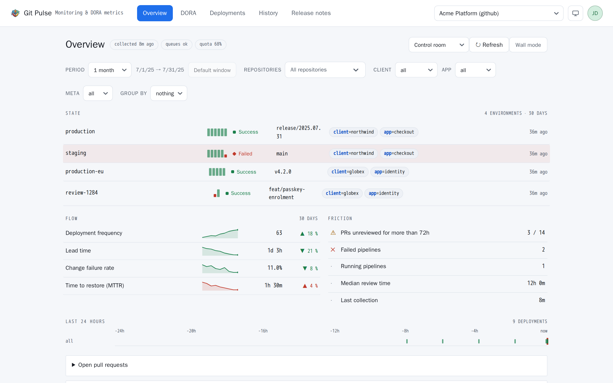
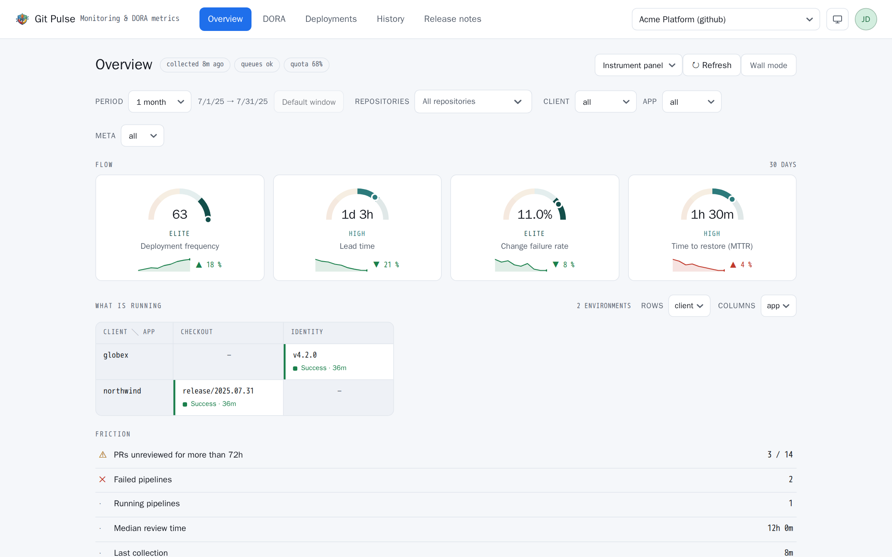
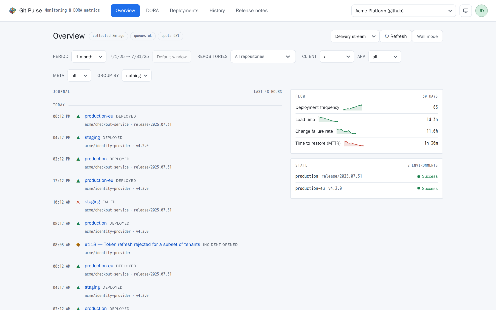

========
Overview
========

The page the application opens on, and the one it is worth leaving open. It
answers *is anything wrong right now* before it answers anything else.

Everything on it comes from a single request, so the environments, the metrics
and the health of the collection all describe the **same instant**. Five
separate calls could not promise that, and a dashboard whose panels disagree
about what time it is teaches people to distrust it.

         four metrics with their trend, what is in the way, and the last
         twenty-four hours on a time axis.

   The control room, the reading the page opens on.

Four readings of the same data
==============================

The switch next to **Refresh** changes how the page is read, never what it
reports. The filters, the period and the scope survive the switch, and the
reading you chose is part of the address — a link carries it.

.. list-table::
   :header-rows: 1
   :widths: 25 75

   * - Reading
     - The question it is shaped around
   * - **Control room**
     - *Is anything wrong right now?* State, flow, friction and the last day,
       top to bottom, in the order somebody glancing at a wall screen asks in
   * - **Instrument panel**
     - *Where do we stand, and who is behind?* The metrics against a published
       scale, and a matrix that shows a stale deployment as a shape rather than
       as a version number
   * - **Delivery stream**
     - *What happened, and in what order?* Deployments and incidents
       interleaved on one rail — the reading to be on when something is
       burning
   * - **Versions**
     - *What is actually running out there?* Not what was deployed — what each
       environment answers when asked. Needs a version rule; see
       :doc:`versions`

The filter bar
==============

Common to the three readings, and to most of the application.

.. list-table::
   :header-rows: 1
   :widths: 25 75

   * - Filter
     - What it does
   * - **Period**
     - A window, or *Custom…* for explicit bounds. **A bound left empty stays
       open**: with no end date the period runs up to now. Metrics are
       recomputed only when you apply
   * - **Repositories**
     - Offered as soon as the source has more than one
   * - Dimensions
     - One selector per word your rules extract — ``app``, ``client``,
       ``type``. Nothing extracted, nothing offered
   * - **meta**
     - Restricts to a meta environment, a group of environments named by a
       rule rather than by the platform
   * - **group by**
     - Folds the board and the timeline on one dimension. Rearranges what is
       already loaded rather than asking for it again — which is why it costs
       nothing to try

Narrowing a *filter* reloads the page; changing the *fold* or the *crossing*
does not. Both end up in the URL either way.

.. note::

   The period the page states under the filter is the one it **actually
   applied**, which differs from the one you asked for whenever a bound was
   left open. When a figure looks wrong, read that line first.

What the period governs
-----------------------

Not everything on the page, and each panel says which it is rather than leaving
you to guess:

.. list-table::
   :header-rows: 1
   :widths: 35 65

   * - Panel
     - The period
   * - State, Flow, the metrics, the gauges
     - **Applies.** These are questions about a window
   * - **What is running** (the matrix) and **Versions**
     - **Does not apply.** They describe the present: what is deployed right
       now, and what each environment answers right now
   * - **Journal** (the delivery stream)
     - **Does not apply.** It always covers the last twenty-four hours
   * - **Last 24 hours** (the timeline)
     - **Does not apply**, as its title says

The scope filters — repositories, dimensions, meta — apply everywhere.

The control room
================

**State** — one row per environment: what reference is running on it, the
status of the last deployment, and how long ago. Folded on a dimension, each
group carries its own count and its own alert count, so the group that needs
somebody is visible without reading the rows.

**Flow** — the four metrics over the window, each with its trend across the
period and its movement. A metric that has not moved reads *= steady* rather
than as a zero dressed up as a rise. *no history* means the window holds too
little to compare against, not that nothing happened.

**Friction** — what is in the way, most actionable first:

.. list-table::
   :header-rows: 1
   :widths: 40 60

   * - Row
     - Read it as
   * - PRs unreviewed for more than *N*\ h
     - Stale over open. The threshold is set in :ref:`settings-general`
   * - Failed pipelines
     - Anything above zero is marked critical
   * - Running pipelines
     - Context, never an alert
   * - Median review time
     - The middle of the distribution, so one forgotten review does not move it
   * - Last collection
     - Only on a stored source, and flagged past an hour

**Last 24 hours** — every deployment of the last day on a shared time axis, one
lane per value of the dimension you folded on. Ticks, not labels: at this width
the question is *how often, and did any of them fail*, and a failed one is
marked. Hovering a tick names the environment and the reference.

The instrument panel
====================

         crossing two dimensions.

   Gauges against the published scale, and the crossing beneath them.

**The gauges** place each metric on the scale the DORA report publishes —
*Elite*, *High*, *Medium*, *Low* — which is the point: it is a scale somebody
outside the team also reads. A metric the report publishes no scale for shows
its figure with *no published scale* under it rather than a tier invented for
the occasion.

**The matrix** crosses two dimensions, one per axis, and shows what was last
deployed in each cell with its status and its age. A client behind on one
application is a shape in a grid, spotted long before anybody compares refs.

It answers about **now**, not about the period — and says so where it is empty.
What the environment is actually *running*, as opposed to what was sent to it,
is the :doc:`versions` reading.

- The two axes are chosen above the grid, and a dimension cannot be crossed
  with itself — pick it on one axis and the other steps aside.
- ``—`` is a crossing that exists on neither axis' terms: no environment
  matches both values.
- ``+2`` on a cell means several environments share that crossing. The cell
  shows one; the tooltip names the others and suggests crossing a third
  dimension to separate them.
- With only one dimension extracted there is nothing to cross, and the page
  says so — with what to change — instead of drawing an empty grid.

The delivery stream
===================

         rail, with the metrics and the environments on a side rail.

   The journal, newest first, with the day it happened as a rule.

Deployments and incidents on **one rail**, in order, with a rule wherever the
calendar day changes and *Today* / *Yesterday* named rather than dated. An
incident that lands twenty minutes after a release reads as a sequence — which
is the whole reason the two are not on two pages.

Four kinds of entry, each with a mark of its own so the colour is never the
only thing carrying the meaning: ``▲`` deployed, ``✕`` failed, ``◆`` incident
opened, ``◇`` incident resolved.

The side rail keeps the metrics and the environments in view while the journal
scrolls. Past eight environments it stops naming them and counts the rest.

The journal always covers **the last twenty-four hours**. The period picked
above does not apply to it, and the page says so where it is empty rather than
letting you read the silence as "nothing happened this quarter".

.. note::

   Incidents come from a tracker on another platform, with an API budget of its
   own, and this reading is the only one that spends it. A missing tracker or
   one that refuses leaves a warning and a journal of deployments — degraded on
   purpose, because a timeline of deployments alone is still worth reading.

Underneath: pull requests and pipelines
=======================================

**Open pull requests** and **Recent pipelines** sit at the foot of the control
room and the instrument panel, folded. They load when you open them, not with
the page — they are lists to read, not figures to glance at, and nobody should
pay for them on a screen left open all day.

Health, in the page title
=========================

Three chips, and they only appear when they have something to say:

.. list-table::
   :header-rows: 1
   :widths: 30 70

   * - Chip
     - Meaning
   * - **collected *N* ago**
     - Age of the last collection. A stored source only — a live one is of the
       moment and has nothing to date. Highlighted past an hour
   * - **queues ok** / **degraded** / **unreachable**
     - The background workers. Anything but *ok* means figures that will stop
       moving, and :ref:`settings-jobs` says why
   * - **quota *N* %**
     - What is left of the platform's API budget. Highlighted under 20 %

Warnings appear as a banner under the filters: a truncated collection, a
partial period, a scope larger than the store holds. They are not errors — the
page is readable — but they explain a figure before somebody has to ask.

Wall mode
=========

**Wall mode** strips the page down to what carries across a room: no switch, no
Refresh nobody is there to press, no filter bar. The address states the scope,
the only control left is the way out, and the page refreshes itself on a
shorter cycle than it does under a reader.

It is a URL like any other, so a display can be pointed at it and left alone.

When the page is thin
=====================

.. list-table::
   :header-rows: 1
   :widths: 45 55

   * - What you see
     - What it usually is
   * - *Nothing was deployed to any environment over this period*
     - The period is shorter than your release cadence, or a dimension filter
       is too narrow. The board follows the period; the matrix does not
   * - Everything under *unclassified*
     - No rule matches your environment names — :ref:`settings-environments`
   * - *No metric over this period*
     - The window is shorter than your delivery cadence, or the scope is empty
   * - Environments but no metrics
     - Deployments are collected, pull requests are not: a credential missing a
       permission
   * - *A matrix needs two dimensions to cross*
     - Your rules extract one word. Add a capture group, or read the control
       room instead
   * - The Versions grid is empty
     - No version rule is enabled on this source — :doc:`versions`. Signed out,
       it is hidden rather than empty
