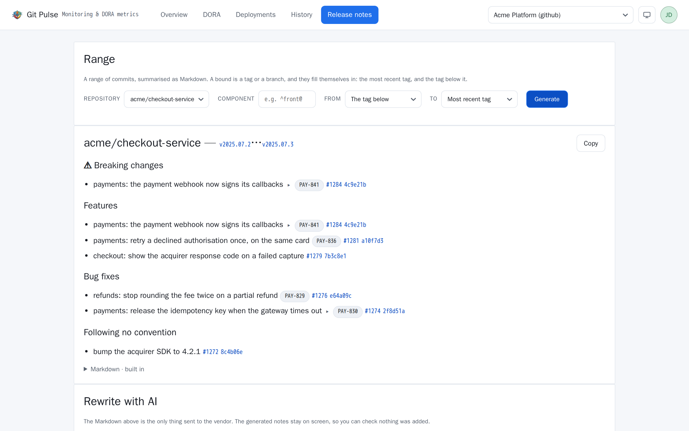

=============
Release notes
=============

A range of commits, read as Conventional Commits and summarised as Markdown —
then, if you want it, rewritten into prose by a model.

         breaking change lifted out, the features and fixes filed under their
         sections, and the commits following no convention kept.

   The range on top, what it amounts to underneath.

Nothing on this page is stored. It is generated when you press **Generate**,
from the platform, and it stays on screen.

Choosing the range
==================

A **repository**, and two bounds that are each a tag or a branch. They fill
themselves in with the answer you usually want: **the most recent tag** as the
upper bound, and **the tag below it** as the lower one — which is the range of
the release about to go out.

- Pick from the tags and branches the repository offers, or leave them alone.
- A repository with **no tag** says so, and offers the alternative: pick a
  branch, or leave the bounds alone to run from the beginning of history to the
  default branch.
- *No repository in this source scope* means the credential lists none — a
  permission, not an empty organization.

.. _release-notes-component:

The **Component** field, between the repository and the bounds
--------------------------------------------------------------

Leave it empty and every tag of the repository is a candidate, which is the
right answer wherever a repository releases one thing.

It earns its keep on a repository that releases several. Such a repository tags
per component, so its tags interleave — ``front@1.2.0``, ``api@3.0.1``,
``front@1.3.0`` — and *the most recent tag* then means whichever component
released last. Unnarrowed, the range for the API starts at a front-end release
and the notes list commits nobody asked about.

The field takes a **regular expression**, matched against tag names and applied
**before** the bounds fill themselves in. So it decides what the two pickers
offer as much as what the defaults choose:

.. list-table::
   :header-rows: 1
   :widths: 26 74

   * - Typed
     - Range on the tags above
   * - *(empty)*
     - ``front@1.3.0`` → ``api@3.0.1`` — two different components
   * - ``^front@``
     - ``front@1.2.0`` → ``front@1.3.0``
   * - ``^worker@``
     - The whole history → the default branch: nothing has released under that
       name yet

A plain ``front`` works too — the expression is not anchored, so it matches
anywhere in the name. Anchor it with ``^`` when two components share a word.

It travels in the address with the rest of the range, so a link reproduces what
its sender was reading. Changing it clears both bounds, exactly as changing the
repository does: they belonged to the component that was showing.

Why a repository would be shaped that way, and what else it changes, is
:doc:`monorepo`.

The generated notes
===================

Commits are read as `Conventional Commits <https://www.conventionalcommits.org>`_
and filed under the section their type names: Features, Bug fixes,
Performance, Reverts, Refactoring, Documentation, Style, Tests, Build,
Continuous integration, Chores.

**Commits following no convention are not dropped.** They land in a section
called *Following no convention*, which is the honest thing to do: silence
there would read as "nothing else changed".

Three things happen beyond sorting:

**Breaking changes are lifted out.** Anything marking itself breaking — the
``!`` or a ``BREAKING CHANGE:`` footer — is repeated at the top under a warning
of its own, rather than being left in the middle of the section it belongs to.

**Squashes are expanded.** A squash merge that replaced fifteen commits is read
as the work it replaced, not as one line.

**Ticket references are resolved into links**, using the tracker rules an admin
set — see :ref:`settings-trackers`. Without those rules the references stay as
written.

The **Markdown** tab is the same notes as text, ready to paste into a release,
a ticket or a mail.

.. note::

   The generator itself is an install-wide choice
   (:ref:`settings-release-notes`), between the built-in one and
   ``conventional-changelog``. The second lists **only** the commits that
   follow the convention, and it does not carry the ticket links the rules
   found. The sections on the page hold everything either way — the choice
   affects the Markdown, not what was read.

Rewriting with a model
======================

Optional, and off unless an admin declared a provider
(:ref:`settings-ai-providers`). It turns a list of commits into something
written for people who did not write them.

.. warning::

   **What is sent is the Markdown above, and nothing else.** Not your code, not
   your diffs, not your repository. The result appears beside it, so you can
   check that nothing was added — a model asked to summarise can also invent,
   and the page is laid out so that comparing is easy rather than optional.

**Language** is either a language you name, or *Follow the commits* — the notes
come back in whatever language the commit messages are written in.

The result is credited: *Rewritten by <provider> (<model>)*. It stays on
screen and is stored nowhere.

When nothing comes out
======================

*No change in this range.* The two bounds resolve to the same tree — most often
a tag that was just moved onto the branch it is being compared with.
