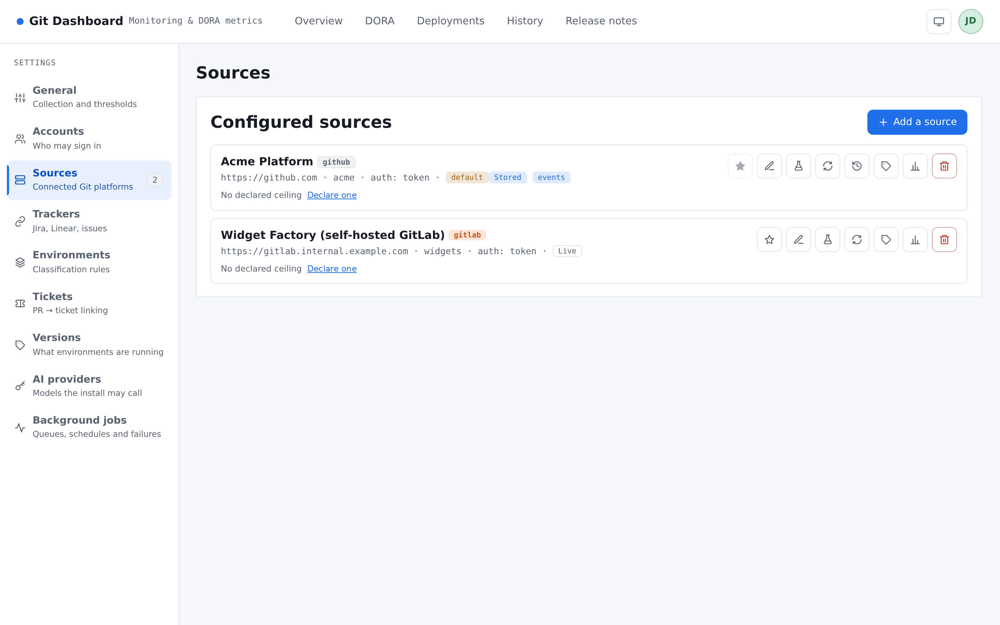
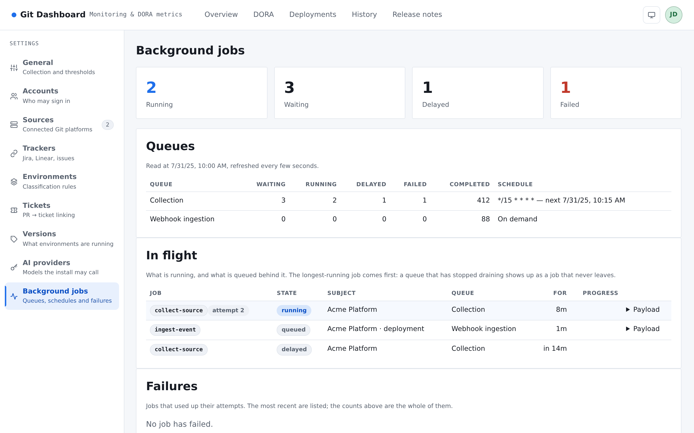

========
Settings
========

Everything an admin configures, on nine sections. **Admins only** — a *User*
account is told so plainly rather than shown an empty page, and the settings
stay behind an account even when the dashboard itself is public.

The order below is the order to work through on a new install.

.. _settings-sources:

Sources
=======

The connected platforms. One source is one organization or group on one
platform; the form itself is walked through in :doc:`getting-started`, and what
to grant its credential is :doc:`credentials`.

         their mode, their quota and the actions available on each.

   What is connected, and what can be done to it.

**Tracked repositories.** A new source tracks every repository of the owner.
Once it exists the selection becomes editable, and only ticked repositories are
collected. **Track new repositories** decides what happens to one created
later: collected without coming back here, or ignored until you do.

**History depth** is how far back ingestion reads — on the first run and on
every reconciliation. It can follow the reporting window instead of being set
on its own. Deeper means more API calls on the first collection and more rows
kept afterwards, which is the trade to make deliberately.

**Accept events (webhooks)** speeds freshness up; the scheduled synchronisation
stays the safety net rather than being replaced. Both this and the history
depth require *stored* reads, and the form says so instead of failing later.
Turning it on hands you a delivery URL and a secret shown once — what to do
with them on the platform is :doc:`credentials`.

Actions on a source
-------------------

.. list-table::
   :header-rows: 1
   :widths: 32 68

   * - Action
     - What it does
   * - **Test connection**
     - Proves the base URL, the owner and the secret together. Only exercises
       the repository listing
   * - **Collect now**
     - Runs a collection immediately. Refused while one is already in flight,
       with the state of the run that is blocking it
   * - **Read the installed versions**
     - Asks every environment what it is running, now, ignoring the fifteen
       minute interval. Only useful once a version rule is attached —
       :doc:`versions`
   * - **Replay the metric history**
     - Recomputes the historised readings over a depth you choose. The one
       thing correcting a rule does *not* fix by itself
   * - **Make default**
     - Which source the application opens on
   * - **Delete**
     - Takes its environment rules, its metric history and its stored data with
       it

**What the source actually holds** is reported beside the depth it asks for:
how many days of history are stored, and how far back the DORA readings go.
The two differ on purpose — readings are historised by the collection, so they
start the day it did, however deep the store is. A report asked over a longer
period than the store holds is answering from data that does not exist, and
this line is where that shows.

**The API budget** is shown per source: calls used, the bucket, and when the
window resets. Where an instance sends no rate-limit header — common
self-hosted — a ceiling can be declared by hand, and it is labelled *declared*
so nobody mistakes it for something the platform said.

.. _settings-environments:

Environments
============

The classification rules: the single highest-value thing to configure, and the
reason the filters are empty until you do. :doc:`getting-started` covers what a
rule is and the two traps. What matters here is how the catalogue is organised.

**Rules are defined once for the whole install, then enabled source by source**
from the source form. A pattern describes a naming convention, and a naming
convention rarely stops at one repository host.

Three tabs, matched against three different things:

.. list-table::
   :header-rows: 1
   :widths: 22 78

   * - Tab
     - Matched against
   * - **Environments**
     - Deployment environment names. Feeds the board's classification and the
       deployment metrics
   * - **Repositories**
     - Repository names. A pull request has no environment, so this is what
       breaks lead time down by application or customer
   * - **Incidents**
     - Incident labels. An incident has no environment either; this is how it
       joins the deployment dimensions

Each rule carries:

.. list-table::
   :header-rows: 1
   :widths: 28 72

   * - Field
     - Meaning
   * - **Pattern (RegEx)**
     - Named groups become attributes — ``(?<type>prod)``. Matched
       **unanchored**
   * - **Kind**
     - *simple* classifies; *meta* additionally names a group of environments
       the filters can select as one
   * - **Priority**
     - **Lower wins** when two rules claim the same attribute
   * - **Forced attributes**
     - Set on a match, for what the name does not spell out
   * - **Repo**
     - A RegEx confining the rule. Empty applies everywhere; a confined rule
       stays silent wherever the repository is unknown

**Test the rule set** classifies a name you type. Two modes, and the difference
matters: against *the rules listed here*, or against *a source's own rules* —
the ones it subscribed to, matched against its own repository names. The second
is the answer production gives.

.. note::

   Deleting a rule does not rewrite what it already classified. Environments
   lose its attributes **on the next collection**, not immediately.

.. _settings-trackers:

Trackers
========

Where tickets and incidents come from — Jira, Linear, or the platform's own
issues.

A tracker is **declared once** and then attached from each source. The base URL
lives on the tracker rather than on every rule, so moving an instance is a
single edit. The link template is derived from the kind unless you override it:
``{key}`` always, plus ``{owner}`` and ``{repo}`` when the tracker lives with
the code.

On the source form, **Incidents read from** picks which attached tracker
supplies incidents. Not every kind can, and the form says so rather than
offering one that will return nothing. Without an incident tracker, no incident
is collected — and change failure rate has nothing to divide by.

.. _settings-tickets:

Tickets
=======

The rules that turn a pull request into a ticket reference. Extracted from
**the branch name first, then the pull request title**.

A rule belongs to its tracker and applies wherever that tracker is attached.
The ``(?<key>…)`` named group yields the key; without one, the whole match is
taken. **Priority: lower wins** when two rules claim the same key.

**Test extraction** runs the saved set over a branch and a title. Use it — it
is how you catch a pattern that matches too much. The page names the classic
one: ``[A-Z]{2,}-\d+`` also eats UTF-8.

.. _settings-versions:

Versions
========

The rules that read back **what an environment is actually running**, by asking
it over HTTP. What they produce, and how to read it, is :doc:`versions`.

Like a classification rule, a version rule is written once for the whole install
and then enabled source by source — a version endpoint is a property of an
application, not of a repository host.

**Which rule answers** is a selection, not an accumulation: among the rules whose
*Environment* and *Repository* patterns match, the **lowest priority number wins
outright** and the others stay silent. A version is a single reading; there is
nothing to merge. Both patterns are optional, both are matched unanchored, and
an empty one means *every one of them*.

**Where it reads**

.. list-table::
   :header-rows: 1
   :widths: 30 70

   * - Placeholder in the URL
     - Resolves to
   * - ``{environmentUrl}``
     - The address the platform published for that environment. Neither
       platform states one unless it was explicitly configured, which is why
       the second shape below exists
   * - ``{repo}`` ``{environment}`` ``{ref}``
     - The deployment's own fields
   * - ``{attr.<key>}``
     - An attribute your classification rules extracted

::

   {environmentUrl}/actuator/info
   https://{attr.client}.example.com/{repo}/version

A placeholder that cannot be filled makes the rule **silent for that
deployment** — the reading is filed with the reason and no request is made.

**How the answer is read** — *Response format* is JSON, XML or Text. For the
first two, the **Version template** is literal text plus ``{path}``
placeholders: ``v{build.version} (build {build.number})``. Paths descend by key
(``build.version``), index a list (``components[1]``) or select from one
(``components[name=back]``). Text rules take a RegEx with named groups instead,
which the template refers to by name.

**Try it** builds the rule against a **pasted response**, touching no network at
all, and clicking a value in the tree writes its path into the template. Use it:
it is faster than a collection and it answers the same question.

.. warning::

   A template holding no placeholder is refused, and a path that resolves to
   nothing fails the whole reading rather than producing half of one.
   ``1.4.2-undefined`` filed beside a deployed ref is worse than no reading:
   it is wrong quietly.

**Authentication** is optional — a bearer token, basic credentials, or a header
you name — and the secret is encrypted at rest and never returned to the form.
Extra headers can be added, and are not the place for a secret.

.. note::

   The address is configuration typed into a form, so the probe refuses what a
   form could otherwise be used to reach: ``http`` and ``https`` only, no
   private or internal address, and **no redirect followed** — a ``302`` would
   otherwise carry the rule's secret to somewhere nobody checked. Five second
   timeout, and a ceiling on the size of the answer.

.. _settings-accounts:

Accounts
========

Who may sign in. Accounts are handed out here and never opened from the sign-in
screen — there is no self-registration.

Two roles, coarse on purpose: **Admin** configures the install, **User** only
reads the dashboard and DORA. That distinction starts to matter the moment the
dashboard stops being public.

**Reset link** issues a single-use link, valid until a stated moment, to hand
over out of band. It is shown once and is not stored in readable form. Issuing
another cancels the first, and using one signs that account out everywhere.

Deleting an account ends its open sessions with it.

.. _settings-ai-providers:

AI providers
============

The models the install may call, used for one thing: rewriting release notes.
Nothing else on the application calls a model, and **release notes are
generated without a provider** — only the rewriting needs one.

A provider is a vendor, a model name as the vendor spells it, and a key. The
key is encrypted at rest and never returned. **Base URL** is optional and
exists for a gateway or a proxy. One provider can be marked as the one to use
when none is named, and **Test** proves the key against the model before
anybody depends on it.

.. _settings-jobs:

Background jobs
===============

What the workers are doing. The page to open when figures have stopped moving.

         schedules, and the jobs currently in flight.

   The queues, their schedule, and what is in flight.

Two queues — **Collection** and **Webhook ingestion** — each with its counts
(waiting, running, delayed, failed, completed) and its schedule, stated as the
cron pattern and the next run. *On demand* means nothing is scheduled.

**In flight** lists what is running and what is queued behind it, **longest-running
first**: a queue that has stopped draining shows up as a job that never leaves.
Each entry carries its age, its progress and its attempt number.

.. warning::

   *Redis is not answering: nothing is being collected in the background.*
   Every stored source is frozen at its last collection, and the pages will
   keep serving that without complaint. This banner, and the *queues* chip on
   :doc:`overview`, are the only places it shows.

.. _settings-general:

General
=======

Four groups.

Reporting
---------

What the metrics are computed over, and what counts as a failure.

.. list-table::
   :header-rows: 1
   :widths: 32 68

   * - Setting
     - Effect
   * - **DORA window**
     - The DORA page's default period, which any filter there overrides — and
       the window **every historised reading is computed over**, which nothing
       overrides
   * - **Stale PR threshold**
     - Beyond this age a pull request is flagged as stale on :doc:`overview`
   * - **Failure source**
     - What counts as a failure for change failure rate and MTTR: failed
       deployment pipelines, declared incidents, or both
   * - **Incident labels**
     - Comma separated. An issue carrying one of them is an incident. Only
       asked for when incidents count

Collection and store
--------------------

When sources are read, when the store is swept, and how much API budget is held
back.

.. list-table::
   :header-rows: 1
   :widths: 32 68

   * - Setting
     - Effect
   * - **Collection cron**
     - How often every stored source is read
   * - **Purge schedule**
     - Sweeps each source down to its own history depth
   * - **Retention margin**
     - Days kept beyond that depth, so deepening a source finds something
       already there
   * - **API reserve (%)**
     - The share of a budget kept for the essential calls. Below it, the
       collection drops the per-pull-request and per-deployment enrichment
       rather than stopping

Interface
---------

How the application looks for everyone who has not chosen otherwise on their
own :doc:`account`: the default overview reading, and the default display mode.

.. _settings-release-notes:

Access and lists
----------------

.. list-table::
   :header-rows: 1
   :widths: 32 68

   * - Setting
     - Effect
   * - **Public dashboard**
     - On by default: the dashboard and DORA are readable without signing in.
       Off, the whole application asks for an account. The settings always do
   * - **Items per page**
     - Default page size of every list
   * - **Release notes generator**
     - What renders the Markdown of a release note: the built-in one, which
       lists every commit and carries the ticket links, or
       ``conventional-changelog``, the convention's own package. The sections
       shown on :doc:`release-notes` list every commit either way
