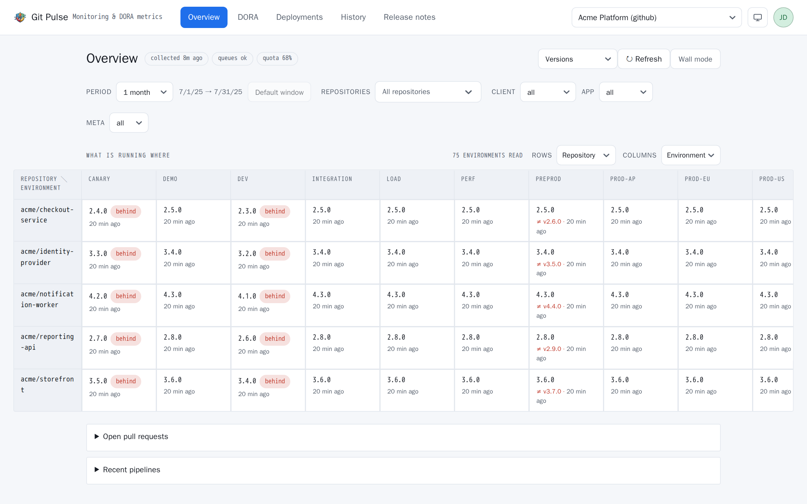

==================
Installed versions
==================

A deployment says what was **sent** to an environment. It does not say what is
**running** there — a pipeline can go green against a container that never
restarted, and nothing on the platform's side would look any different.

This is the part of the application that asks the environment itself, over HTTP,
and files what it answers.

.. note::

   Nothing here exists until an admin writes a **version rule**
   (:ref:`settings-versions`) and a source enables it. Without one, the reading
   below is empty and no deployment carries a version. It is the one feature
   that reaches outside the Git platform, so it is off until somebody asks for
   it.

What is running where
=====================

The fourth reading of :doc:`overview` — a grid of what every environment
answers, crossing two axes you choose. **Repository** and **Environment** are
offered alongside whatever dimensions your rules extract.

         release that environment answers.

   One cell per environment, carrying the release it answers today.

Three markings, and each one means something different:

.. list-table::
   :header-rows: 1
   :widths: 25 75

   * - Marking
     - What it says
   * - **behind**
     - A newer release of **this same repository** is running on another
       environment. Staging ahead of production is normal; production ahead of
       staging is worth a look
   * - **Several releases**
     - Only where the axes fold more than one environment into a cell: the ones
       that landed there do not agree with each other
   * - **≠ v2.6.0**
     - The environment answers a release that is **not** the ref deployed to
       it. The deployment went out; what is running is something else

A cell with no marking is an environment answering exactly what it was last
given, which is the whole point of asking.

.. important::

   **The period does not apply to this reading.** It shows what is running
   *now*, not what ran during a window. The other filters — repositories,
   dimensions — do apply, and an empty grid under a narrow filter says so and
   offers to clear them.

Where a reading can go wrong
----------------------------

A reading is filed even when it failed, because an environment that stopped
answering must not go on displaying last week's version:

.. list-table::
   :header-rows: 1
   :widths: 25 75

   * - Status
     - Meaning
   * - **read**
     - Answered, and the rule found a version in the answer
   * - **unreachable**
     - The request was made and brought back nothing usable
   * - **not found**
     - The response arrived; the rule found no version in it
   * - **not read**
     - No request was made. The row carries the reason — most often a URL the
       rule could not build

.. warning::

   This reading is **hidden from signed-out visitors**, even where the public
   dashboard is on. It names the release exposed on every public address, which
   is not a thing to publish. Signing in shows it.

Since when has it been running?
===============================

A cell opens the **timeline** of that environment: every version it has run,
when each arrived, and how long it was held.

.. list-table::
   :header-rows: 1
   :widths: 28 72

   * - On an entry
     - Meaning
   * - **running now**
     - The version the last reading found
   * - **held for …**
     - How long the previous one lasted. A version ends when the next begins
   * - **Deployed <ref>**
     - The deployment that explains this change
   * - **no deployment**
     - Nothing on the platform explains it

**A change with no deployment is the headline, not a footnote.** Something moved
the version and the platform knows nothing about it: a restart on an older
image, a rollback done outside the pipeline, a drift nobody declared. It is the
one thing no per-deployment record can show you, and it is why this timeline is
kept separately from the deployments.

.. note::

   Under every page of the timeline is the date the readings **start**. A short
   timeline is not proof of a stable environment — it may be a rule written last
   week. Letting silence read as evidence is the mistake that note exists to
   prevent.

The version beside a deployment
===============================

On :doc:`deployments`, a **Live version** column reports what was read *while
that deployment was the live one* — not what is running today.

.. list-table::
   :header-rows: 1
   :widths: 25 75

   * - What you see
     - Read it as
   * - A version, and *read N min after the deployment*
     - The environment was asked while this deployment was live, and this is
       what it said. The delay matters: a reading taken thirty seconds in can
       still describe the version being replaced
   * - **current state**
     - This is the deployment still live, so the figure is simply today's
       reading — not a version this deployment is known to have delivered
   * - **not read**
     - No probe reached the environment while this deployment was live.
       **It cannot be recovered**: asking now answers about what is running now
   * - **differs**
     - What was read is not the ref that was deployed

Reading it now
==============

The scheduled collection reads each environment at most every fifteen minutes —
unless a deployment arrived since the last reading, which makes it due
immediately. Waiting a quarter of an hour to confirm a deployment is not
confirming a deployment.

Where webhooks are on, a successful deployment event triggers a reading of the
one environment it reached, after a short settling delay: the platform calls a
deployment done before the application has finished coming back up, and reading
too early files the version being *replaced*.

For the moment you are watching a release go out, :ref:`settings-sources`
carries **Read the installed versions**, which ignores the interval and reads
them all again now. Its answer distinguishes three things that look identical
from a distance: no rule attached to the source, rules attached but no
environment collected yet for them to describe, and the readings themselves.

.. note::

   These requests go to **your own applications**, not to GitHub or GitLab, so
   none of them spends the platform's API budget.
